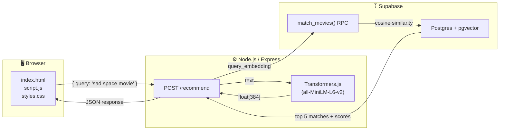
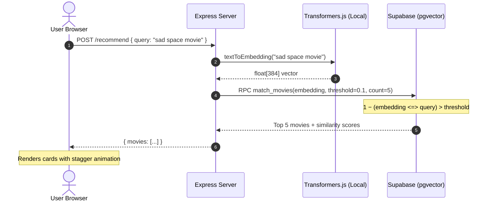

<div align="center">

# 🎬 PopChoice

### AI-Powered Semantic Movie Recommendation Engine

**Natural language in → intelligent recommendations out.**<br>
No API keys. No cloud AI. Just a local transformer model that *understands meaning*.

[](https://nodejs.org/)
[](https://expressjs.com/)
[](https://supabase.com/)
[](https://huggingface.co/docs/transformers.js)

[Features](#-features) · [Architecture](#-architecture) · [Quick Start](#-quick-start) · [How It Works](#-how-the-ai-works) · [Tech Stack](#-tech-stack)

</div>

---

## 💡 The Problem

Traditional movie search relies on **keyword matching** — search "sad space movie" and you'll only find results containing those exact words. This fails to capture *intent*, *emotion*, or *thematic similarity*.

**PopChoice solves this** by converting natural language queries into high-dimensional vector embeddings using a local ML model, then performing cosine similarity searches against a vector database. The result: searching *"a movie to make me cry with my siblings"* intelligently surfaces emotional family dramas — no keyword overlap required.

---

## ✨ Features

| Feature | Description |
|---|---|
| 🧠 **Local AI Inference** | Runs `Xenova/all-MiniLM-L6-v2` transformer model on-device via Transformers.js — zero external API calls, zero cost, full privacy |
| 🔍 **Semantic Vector Search** | 384-dimensional embeddings stored in Supabase with `pgvector`; cosine similarity computed at the database level via custom Postgres RPC |
| 🎨 **Glassmorphic UI** | Premium dark-mode interface with `backdrop-filter` blur, animated gradient accents, floating background blobs, and stagger-fade card reveals |
| ⚡ **Suggestion Chips** | Pre-built query shortcuts (Superhero Action, Emotional Drama, etc.) for instant exploration |
| 📱 **Fully Responsive** | Pill search bar collapses to stacked layout on mobile; grid auto-fills for any viewport |
| 🎯 **Match Confidence** | Each result displays a percentage-based similarity score so users see *how well* a movie matches their query |
| 🌱 **One-Command Seeding** | Batch embedding generation + database upload in a single `npm run seed` |

---

## 🏗 Architecture



### Request Lifecycle



---

## 🚀 Quick Start

### Prerequisites

- **Node.js** v18+ → [Download](https://nodejs.org/)
- **Supabase** account (free tier works) → [Sign up](https://supabase.com/)

### 1 · Clone & Install

```bash
git clone https://github.com/<your-username>/PopChoice.git
cd PopChoice
npm install
```

### 2 · Initialize the Database

Open the **SQL Editor** in your Supabase dashboard and run the contents of [`supabase_setup.sql`](supabase_setup.sql):

```sql
-- Enables pgvector for embedding storage
create extension if not exists vector;

-- Creates movies table with a 384-dim vector column
create table if not exists movies (
  id bigint primary key generated always as identity,
  title text not null,
  release_year text,
  content text not null,
  embedding vector(384)
);

-- Postgres function for cosine similarity search
create or replace function match_movies (
  query_embedding vector(384),
  match_threshold float,
  match_count int
) returns table (id bigint, title text, release_year text, content text, similarity float)
language sql stable as $$
  select id, title, release_year, content,
         1 - (movies.embedding <=> query_embedding) as similarity
  from movies
  where 1 - (movies.embedding <=> query_embedding) > match_threshold
  order by similarity desc
  limit match_count;
$$;
```

### 3 · Configure Environment

Create a `.env` file in the project root:

```env
SUPABASE_URL=https://your-project.supabase.co
SUPABASE_KEY=your-anon-or-service-key
PORT=3000
```

> Find these under **Settings → API** in your Supabase dashboard.

### 4 · Seed the Vector Database

```bash
npm run seed
```

This downloads the AI model (~30 MB, cached after first run), generates embeddings for all movies in `content.js`, and inserts them into Supabase.

### 5 · Launch

```bash
npm start
```

```
⏳ Loading AI model... (this takes ~10 seconds the first time)
✅ AI model is ready!
🚀 Server is running at: http://localhost:3000
```

Open **http://localhost:3000** and start searching!

---

## 🧠 How the AI Works

### Step 1 — Text → Embedding (Local NLP)

When the server boots, it loads the `Xenova/all-MiniLM-L6-v2` sentence transformer model into memory. Every search query is transformed into a **384-dimensional float vector** that encodes semantic meaning:

```javascript
// server.js — convert any text into a meaning-vector
const result = await aiModel(text, { pooling: 'mean', normalize: true });
const embedding = Array.from(result.data);
// → [0.0125, -0.0456, ..., 0.1192]  (384 floats)
```

Texts with similar *meaning* produce vectors that are geometrically close — even if they share zero words in common.

### Step 2 — Vector Similarity Search (Postgres)

The `pgvector` extension adds a cosine distance operator (`<=>`) to Postgres. The `match_movies` RPC function computes:

$$\text{similarity} = 1 - (\vec{movie} \Leftrightarrow \vec{query})$$

Results above the threshold are ranked by similarity and returned — no `LIKE`, no `ILIKE`, no full-text search. Pure mathematical meaning comparison.

### Why This Approach?

| Approach | "sad romantic movie" finds… |
|---|---|
| Keyword Search (`LIKE`) | Only results containing "sad", "romantic", or "movie" |
| Full-Text Search (`tsvector`) | Stemmed keyword matches — slightly better, still lexical |
| **Vector Search (this project)** | *Any* movie with emotional/romantic themes, regardless of wording |

---

## 🛠 Tech Stack

| Layer | Technology | Purpose |
|---|---|---|
| **Frontend** | Vanilla HTML / CSS / JS | Glassmorphic UI with CSS animations, no framework overhead |
| **Backend** | Node.js + Express | REST API server serving static files and the `/recommend` endpoint |
| **AI/ML** | Transformers.js (`all-MiniLM-L6-v2`) | On-device sentence embeddings — no API keys, no cloud dependency |
| **Database** | Supabase (Postgres + pgvector) | Vector storage + cosine similarity RPC for semantic search |
| **Styling** | CSS Custom Properties + `@keyframes` | Design system with gradient accents, blur effects, responsive grid |
| **Fonts** | Google Fonts (Outfit) | Modern, clean typography with multiple weight variants |

---

## 📁 Project Structure

```
PopChoice/
├── public/                     # Static frontend assets
│   ├── index.html              # App shell — semantic HTML5 with accessibility
│   ├── script.js               # Client logic — fetch API, DOM rendering, stagger animations
│   └── styles.css              # Design system — CSS vars, glassmorphism, responsive breakpoints
├── server.js                   # Express server — model loading, embedding generation, Supabase RPC
├── seed.js                     # One-time script — batch vectorize movies and insert into DB
├── content.js                  # Movie catalog — titles, years, rich text descriptions
├── supabase_setup.sql          # DB schema — pgvector extension, movies table, match_movies function
├── .env                        # Environment config — Supabase credentials + port
└── package.json                # Dependencies & scripts — start, seed
```

---

## 🎨 UI / UX Highlights

<table>
<tr>
<td width="50%">

**🌊 Glassmorphic Cards**
- `backdrop-filter: blur(12px)` with semi-transparent backgrounds
- Purple accent borders on hover with `box-shadow` glow
- Lift animation (`translateY(-5px)`) for tactile feedback

</td>
<td width="50%">

**✨ Micro-Animations**
- Header slides down, search slides up on page load
- Movie cards stagger-fade with incremental `animation-delay`
- Background blobs drift continuously with `@keyframes drift`

</td>
</tr>
<tr>
<td>

**🎨 Design System**
- 7 CSS custom properties for consistent theming
- Gradient accent: `#3b82f6 → #8b5cf6 → #ec4899`
- Outfit font family at 300/400/600/800 weights

</td>
<td>

**📱 Responsive Layout**
- Pill search bar → stacked column on mobile (<600px)
- Auto-fill grid: `repeat(auto-fill, minmax(290px, 1fr))`
- Touch-friendly chip buttons with generous tap targets

</td>
</tr>
</table>

---

## 📚 Key Engineering Decisions

| Decision | Rationale |
|---|---|
| **Local ML over cloud APIs** | Zero cost, no API key management, no rate limits, full data privacy. The trade-off (10s cold start) is acceptable for a demo. |
| **pgvector over in-memory search** | Database-level vector search scales with dataset size and supports SQL-native filtering (e.g., by year, genre). |
| **Vanilla CSS over frameworks** | Demonstrates deep understanding of CSS fundamentals — custom properties, `backdrop-filter`, `@keyframes`, responsive design — without framework abstraction. |
| **Combined embedding text** | Concatenating `title + year + content` before embedding captures richer semantics than description alone. |
| **Express static serving** | Eliminates CORS complexity in production — frontend and API share the same origin. |

---

## 🧩 What I Learned Building This

- **Vector Embeddings & Semantic Search** — How transformer models encode meaning into high-dimensional space, and how cosine similarity retrieves semantically related content without keyword matching.
- **pgvector & Supabase RPC** — Writing custom Postgres functions that operate on vector types and exposing them via Supabase's RPC layer.
- **Transformers.js** — Running HuggingFace models entirely in Node.js without Python, ONNX runtime, or external services.
- **Glassmorphic Design** — Implementing modern UI patterns with pure CSS: `backdrop-filter`, layered transparency, and animation composition.
- **Full-Stack Integration** — Connecting a browser frontend → Express API → local ML model → vector database in a clean, well-documented pipeline.

---

## 🗺️ Roadmap

- [ ] Add movie poster images via TMDB API integration
- [ ] Implement genre/year filtering alongside semantic search
- [ ] Expand movie catalog with a bulk import script
- [ ] Add user history & saved recommendations
- [ ] Deploy to Railway/Render with persistent Supabase backend

---

## 📄 License

This project is open source and available under the [MIT License](LICENSE).

---

<div align="center">

**Built with ❤️ using Node.js, Transformers.js, and Supabase**

*If you found this interesting, feel free to ⭐ the repo!*

</div>
