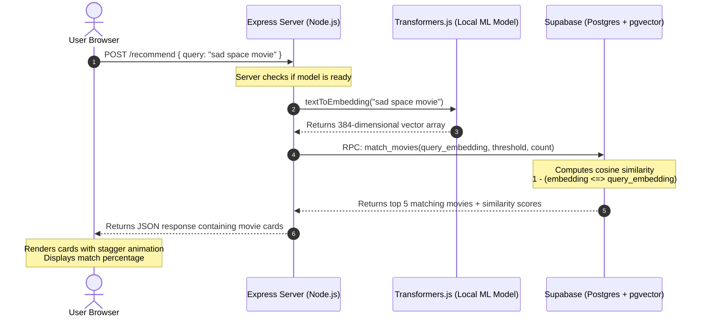

# 🎬 PopChoice: AI-Powered Semantic Movie Recommendations

PopChoice is a modern, responsive web application that provides movie recommendations based on **semantic search** rather than simple keyword matches. Instead of looking for exact words, PopChoice uses a local Machine Learning model to understand the *meaning* of your request (e.g., finding emotional family dramas when searching for "a movie to make me cry with my siblings").

---

## 🚀 Key Features

*   **Local AI Embeddings (Transformers.js)**: Runs the `Xenova/all-MiniLM-L6-v2` transformer model directly on the Node.js server. No external API keys or network requests are needed to generate vector embeddings.
*   **Vector Database Storage & Search (Supabase + pgvector)**: Stores movie descriptions as 384-dimensional vectors in Supabase and runs cosine similarity searches using Postgres functions.
*   **Premium Glassmorphic UI**: Beautiful, modern frontend styled with vanilla CSS, featuring glowing background blobs, slow drift animations, stagger-fade load animations, example suggestion chips, and full responsiveness on mobile.
*   **Seeding Tool**: An automatic script that parses catalog movies, generates semantic embeddings for each, and uploads them to the database in batches.

---

## 📐 System Architecture

The following diagram illustrates how search requests flow through the application:



---

## 📁 File Structure

```text
PopChoice/
├── public/                 # Static frontend files served by Express
│   ├── index.html          # Main application page structure
│   ├── script.js           # Client-side user input & API fetching
│   └── styles.css          # Glassmorphic UI, animations, and layouts
├── .env                    # Secret environment variables (Supabase URL/Keys)
├── content.js              # Source movie metadata catalog used for seeding
├── package.json            # Node.js dependencies and script definitions
├── seed.js                 # Script to generate movie embeddings and seed Supabase
├── server.js               # Node.js Express server & vector query route
└── supabase_setup.sql      # SQL script to initialize DB schema and matching function
```

---

## 🛠️ Step-by-Step Setup

Follow these instructions to set up and run PopChoice locally.

### Prerequisites
*   [Node.js](https://nodejs.org/) installed (v18+ recommended)
*   A free [Supabase](https://supabase.com/) account and project

---

### Step 1: Install Dependencies

Clone or locate this directory, open a terminal in the folder, and run:
```bash
npm install
```

---

### Step 2: Initialize Supabase Database

1. Go to your **Supabase Dashboard** and open the **SQL Editor** for your project.
2. Copy and paste the contents of [supabase_setup.sql](file:///c:/Users/91630/OneDrive/Desktop/FullStock%20By%20Scrimba/backend/PopChoice/supabase_setup.sql) into a new query.
3. Run the query. This will:
   * Enable the `vector` extension (`pgvector`).
   * Create a `movies` table containing columns for `title`, `release_year`, `content`, and a `vector(384)` for `embedding`.
   * Create a Postgres function called `match_movies` to perform similarity matching.

---

### Step 3: Configure Environment Variables

Create a file named `.env` in the root of the project (or modify the existing one) with the following structure:

```env
SUPABASE_URL=YOUR_SUPABASE_PROJECT_URL
SUPABASE_KEY=YOUR_SUPABASE_ANON_OR_SERVICE_KEY
PORT=3000
```
> ⚠️ **Important**: Replace placeholders with your actual Supabase Project URL and API Key found under *Settings > API* in the Supabase Dashboard.

---

### Step 4: Seed the Database

Run the database seeder to process the initial list of movies defined in `content.js`. The script will download the AI model, convert movie descriptions to vectors, and upload them to Supabase:

```bash
npm run seed
```

---

### Step 5: Start the Server

Run the development server:
```bash
npm start
```

Once loaded, the terminal will display:
```text
⏳ Loading AI model... (this takes ~10 seconds the first time)
✅ AI model is ready!
🚀 Server is running at: http://localhost:3000
   Open this URL in your browser to use the app!
```
Open **`http://localhost:3000`** in your web browser to test your new recommendation engine!

---

## 🧠 How the AI Vector Search Works

### 1. Generating Embeddings (Local NLP)
When the server boots, it downloads and initializes the `Xenova/all-MiniLM-L6-v2` transformer model. 
When search requests or seed tasks are run, text content is transformed into an array of **384 float numbers**:
```javascript
// From seed.js & server.js
const result = await aiModel(text, { pooling: 'mean', normalize: true });
const embedding = Array.from(result.data); // e.g. [0.0125, -0.0456, ..., 0.1192]
```

### 2. Computing Similarity in Postgres
Vector database searches do not rely on traditional SQL `LIKE` queries. Instead, the Postgres `pgvector` extension calculates the angle between vector points using the cosine distance operator (`<=>`). 

The SQL function `match_movies` finds matching rows by evaluating:
$$\text{Similarity Score} = 1 - (\text{movies.embedding} \Leftrightarrow \text{query\_embedding})$$

```sql
select
  movies.id,
  movies.title,
  movies.release_year,
  movies.content,
  1 - (movies.embedding <=> query_embedding) as similarity
from movies
where 1 - (movies.embedding <=> query_embedding) > match_threshold
order by similarity desc
limit match_count;
```

---

## 🎨 User Interface & Design Elements

PopChoice features a high-fidelity visual design written entirely in **Vanilla CSS** (`styles.css`):
*   **Glassmorphic Design**: Clean cards with `backdrop-filter: blur(12px)` and semi-transparent borders.
*   **Animated Gradient Accents**: Rich hues (blue to magenta) applied to typography and key action buttons.
*   **Floating Background Blobs**: Soft SVG-like animated background circles that drift dynamically using `@keyframes drift`.
*   **Responsive Pill Search**: Responsive search input container that collapses gracefully on mobile devices.
